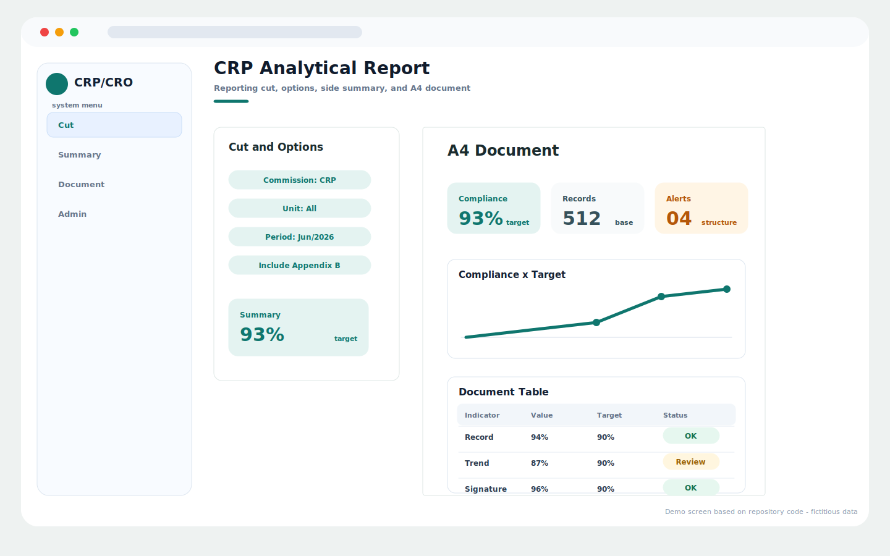
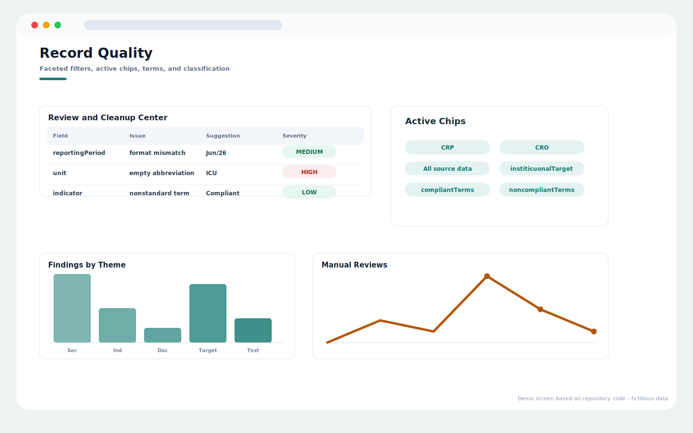
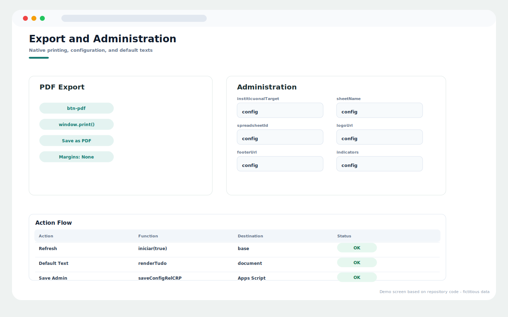

# Clinical Reporting Suite

Repository: `clinical-reporting-suite`

## Overview

CRP/CRO reporting dashboard for analytical reports, data quality review, native PDF export, and administrative configuration.

## Main Capabilities

- Report filters, active chips, commission switch, and summary panel.
- A4 document pages with compliance indicators, charts, and tables.
- Data-quality review center with suggested and manual corrections.
- Administrative configuration for targets, sheet names, terms, logos, and report text.

## Operating Flow

1. Choose the commission and reporting cut.
2. Review the summary panel and A4 report page.
3. Use the quality screen to inspect inconsistent data.
4. Export the report through the native print-to-PDF flow.

## Visual System Guide

> The screens below are documentation mockups based on the components, labels, colors, and workflows found in this repository. All displayed data is fictitious and does not represent real patients, staff members, or institutions.

### CRP/CRO - reporting dashboard

### CRP/CRO - record quality

### CRP/CRO - export and admin

## Data Privacy

The repository documentation and guide images use fictitious sample data only.

## Technologies

- JavaScript
- HTML/CSS
- Google Apps Script
- Google Sheets

## Status

Completed
